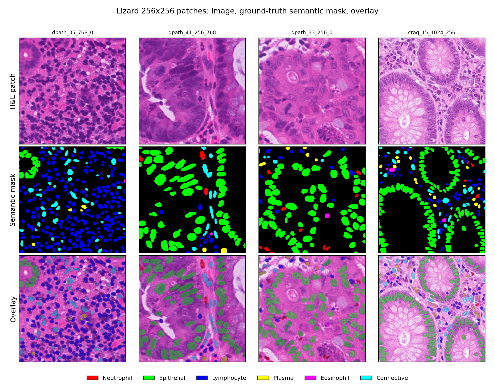
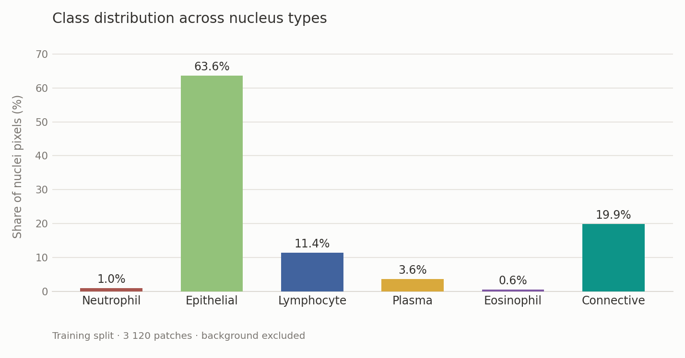
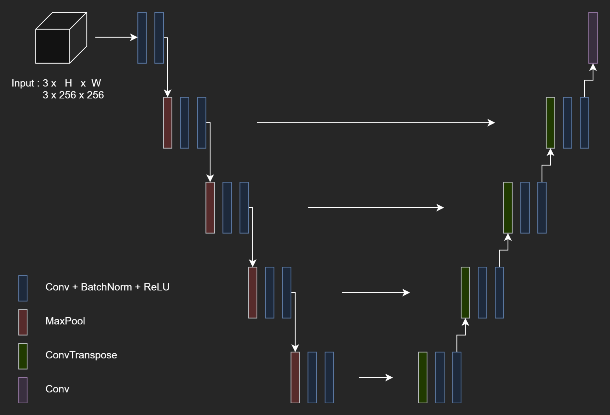
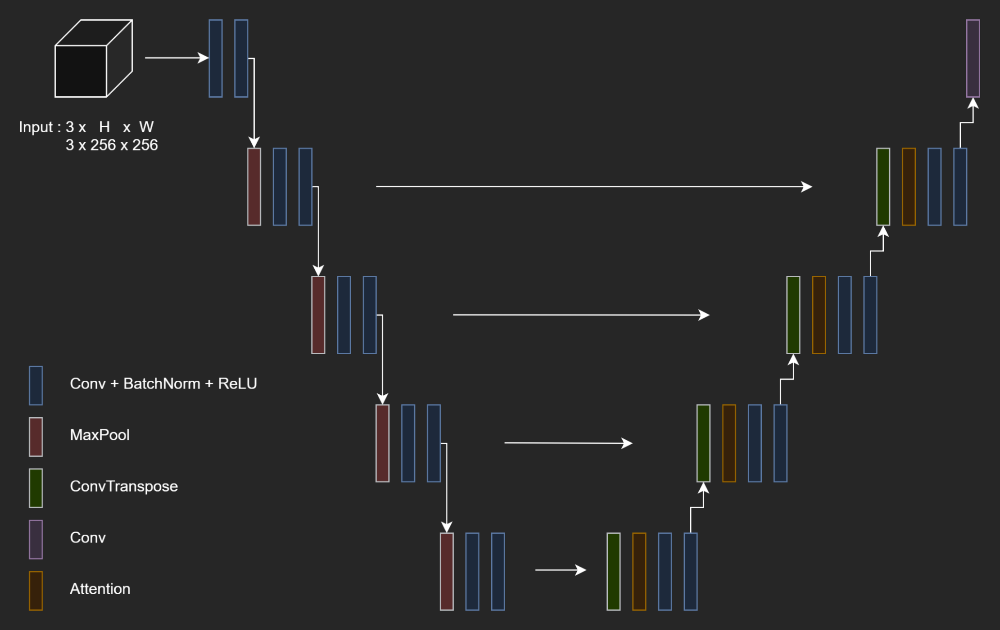

# Attention U-Net for Nuclei Segmentation on the Lizard Dataset


> Semantic segmentation of six nucleus types in H&E-stained colon histology, using a U-Net with attention gates on the skip connections. Created as the second project in a pair from the ZNEUS course at FIIT, the first being [molecular bioresponse classification](https://github.com/eakosh/bioresponse-classification)


## Dataset



[Lizard](https://ieeexplore.ieee.org/document/9607772) contains colon histology regions at 20x magnification, compiled from five datasets: CoNSeP, CRAG, DigestPath, GlaS and PanNuke. The original version is not openly available, so a [reduced public version](https://www.kaggle.com/datasets/aadimator/lizard-dataset) was used, with the same six classes and the same annotation format but considerably fewer images. Absolute results are therefore not comparable to published Lizard benchmarks

| Split | Source patches | Files on disk |
|-------|---------------|---------------|
| Train | 1 040 | 3 120 |
| Validation | 1 137 | 1 137 |
| Test | 1 007 | 1 007 |

The training split was expanded offline by writing two augmented copies of each patch to disk. Validation and test contain no augmented copies, so evaluation runs on the original distribution



The dataset is severely imbalanced. Epithelial nuclei account for 63.6% of annotated nucleus pixels, while plasma cells account for 3.6%, neutrophils for 1.0% and eosinophils for 0.6%

## Baseline



The baseline is a standard U-Net trained with cross-entropy. The encoder is built from repeated double convolutional blocks, each consisting of two 3x3 convolutions with batch normalisation and ReLU followed by max-pooling, with channel widths 64, 128, 256, 512, 512. The decoder mirrors it using transposed convolutions, plain skip connections and the same double convolutional blocks, and a final 1x1 convolution maps the decoder output to seven classes

## Implemented Extensions

### Attention gates



A plain skip connection passes the entire encoder feature map to the decoder regardless of its relevance, which tends to blur the boundaries of small objects such as nuclei. An attention gate was therefore added to every decoder stage. The gate takes the upsampled decoder signal as the gating input and the encoder skip as the feature input, projects both into a shared intermediate space with 1x1 convolutions, sums them and passes the result through ReLU and a sigmoid to produce a single-channel spatial map. The skip is multiplied by this map before concatenation, which attenuates it in regions the decoder is not responding to

### Combined loss

Weighted combination of three terms was used:

- Focal loss, which down-weights easy pixels and concentrates the gradient on pixels the model classifies poorly
- Cross-entropy, which retains the stable global signal and the overall class structure
- Soft Dice, which optimises region overlap directly, the quantity the evaluation metric measures

The cross-entropy and focal terms additionally carry a per-class weight, rising as a class becomes rarer, with the two rarest sharing a cap of 7.0

### Rare-class oversampling

Neutrophils and Eosinophils were defined as rare classes. Every patch whose mask contains at least one pixel of either class is repeated in the training index, which raises the neutrophil share of the training data from 1.0% to 1.7% and the eosinophil share from 0.6% to 0.9%. Validation and test are excluded from this, so the evaluation distribution is unaffected

## Results

The final configuration reaches a mean IoU of 0.472 and a pixel accuracy of 0.926 on the held-out test split, over 28 epochs before early stopping

| Class | Share of nuclei pixels | Test IoU |
|-------|-----------------------|----------|
| Background | - | **0.929** |
| Epithelial | 63.6% | 0.615 |
| Lymphocyte | 11.4% | 0.538 |
| Connective tissue | 19.9% | 0.487 |
| Plasma | 3.6% | 0.324 |
| Eosinophil | 0.6% | 0.257 |
| Neutrophil | 1.0% | 0.154 |

Per-class IoU broadly follows class frequency. Lymphocytes are the exception, scoring above connective tissue despite being half as common

Only the two oversampled classes overfit: neutrophils reach 0.401 on train against 0.154 on test and eosinophils 0.395 against 0.257, while every other class scores the same or slightly better on test than on train

### Effect of oversampling

| Class | Without | With |
|-------|---------|------|
| Background | 0.925 | **0.929** |
| Epithelial | 0.591 | **0.615** |
| Lymphocyte | 0.508 | **0.538** |
| Connective tissue | 0.461 | **0.487** |
| Plasma | **0.336** | 0.324 |
| Eosinophil | 0.205 | **0.257** |
| Neutrophil | 0.148 | **0.154** |
| **mean IoU** | 0.453 | **0.472** |

Oversampling improves six of seven classes and raises mean IoU by 0.019, with the largest gain on eosinophils, the rarest class 

### Ablation

Each row adds one modification to the row above. These runs use a per-batch mean IoU, which drops a class from the average whenever a batch contains none of it in either the prediction or the ground truth. The two rarest classes fall out that way, so every figure below is inflated relative to the pooled metric used above, and the rows are comparable only to each other

| Configuration | test mIoU | test accuracy |
|---------------|-----------|---------------|
| Baseline U-Net, cross-entropy | 0.452 | 0.938 |
| \+ augmentation | 0.473 | **0.940** |
| \+ class weights | 0.467 | 0.936 |
| \+ focal and dice | 0.471 | 0.932 |
| Smaller encoder, 32 to 256 | 0.475 | 0.935 |
| \+ oversampling of rare classes | **0.492** | 0.934 |
| \+ attention gates | 0.484 | 0.930 |

Augmentation and oversampling produced the largest gains, and the smaller encoder matched the full one, indicating that capacity was not the limiting factor

## Summary

This project implemented a U-Net with attention gates for seven-class semantic segmentation of cell nuclei in colon histology, and evaluated a sequence of modifications aimed at the dataset's severe class imbalance. Augmentation and rare-class oversampling produced the largest improvements, while reducing encoder width left results unchanged. The final configuration reaches a test mean IoU of 0.472, with per-class IoU ranging from 0.929 on background to 0.154 on neutrophils

## What’s where
- `src/` — training code
  - `train.py` — launches training
  - `config.py` — data paths (`DATA_ROOT`), hyperparameters, class weights, W&B flags
  - `model.py` — U-Net architecture
  - `patch_datamodule.py` / `patch_dataset.py` — Lightning data module and dataset for pre-cut patches
  - `transforms.py` — augmentations and preprocessing
  - `generate_patches.py` — optional script to create patches from raw slides/masks
  - `visualize.py` — validation visualization callback
- `eda/eda.ipynb` — exploratory notebook

## Setup

### 1. Environment

```bash
pip install -r requirements.txt
```

Trained on Kaggle with a single GPU. Tested locally on Windows 11 with an RTX 3050

### 2. Dataset

Patches are generated from the raw [Lizard files](https://www.kaggle.com/datasets/aadimator/lizard-dataset), which are expected under `data/`:

```bash
python src/generate_patches.py
```

`DATA_ROOT` in `src/config.py` is resolved at import time: it searches for `patches/train/img` under `/kaggle/input` and falls back to `./patches`, so the same configuration works locally and on Kaggle

### 3. Training

```bash
python src/train.py

# resume from a checkpoint
python src/train.py --resume_from_checkpoint checkpoints/last.ckpt
```

Training is logged to Weights & Biases, which requires `wandb login` on first run, setting `USE_WANDB = False` in `src/config.py` disables it

